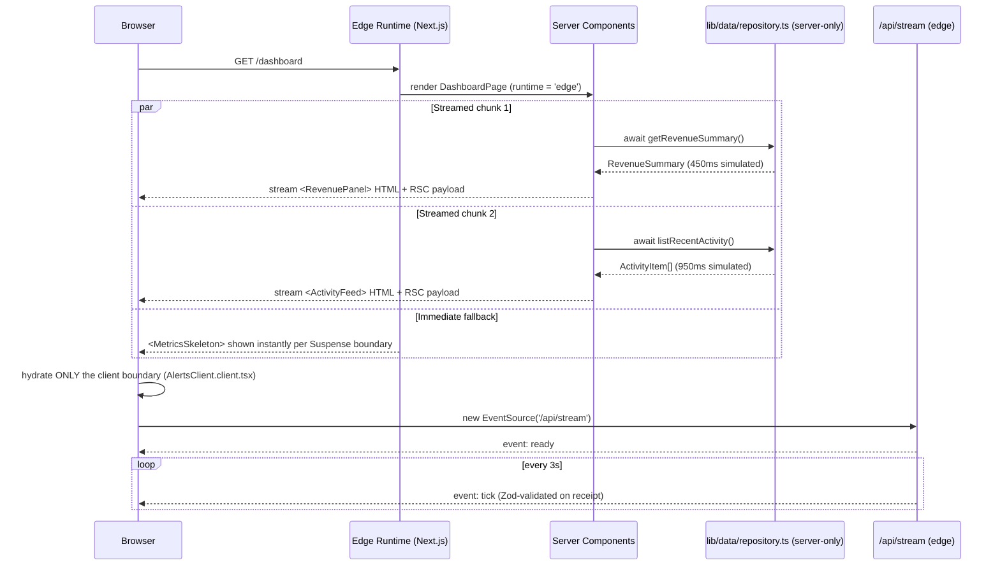

# Architectural Server-Side Paradigms

**React Server Components (RSCs) & Streaming.** A runnable Next.js 15 / React 19 project that demonstrates the server/client component boundary, Suspense-driven streaming SSR, edge-runtime rendering, and Server-Sent Events as a real, end-to-end architecture — not slideware.


## Table of Contents

- [Overview](#overview)
- [Mental Model](#mental-model)
- [Repository Structure](#repository-structure)
- [Core Concepts / Deep Dive](#core-concepts--deep-dive)
  - [Server components that never ship to the client](#1-server-components-that-never-ship-to-the-client)
  - [Streaming with per-section `Suspense` boundaries](#2-streaming-with-per-section-suspense-boundaries)
  - [The single client boundary: live alerts over SSE](#3-the-single-client-boundary-live-alerts-over-sse)
  - [Edge runtime + `server-only` enforcement](#4-edge-runtime--server-only-enforcement)
  - [Zod at the SSE trust boundary](#5-zod-at-the-sse-trust-boundary)
  - [React Compiler](#6-react-compiler)
- [Getting Started](#getting-started)
- [Further Reading / Related Repos](#further-reading--related-repos)

## Overview

This repository is the "real runnable project" companion to the architectural blueprint in [`docs/ADVANCED_REACT_EDGE_BLUEPRINT.md`](./docs/ADVANCED_REACT_EDGE_BLUEPRINT.md). It implements a single `/dashboard` route that composes:

- **Async Server Components** (`RevenuePanel.server.tsx`, `ActivityFeed.server.tsx`) that read data directly on the server via a `server-only` repository layer — none of that code, or its dependencies, is sent to the browser.
- **Per-section `Suspense` boundaries** so the page shell streams immediately and each panel pops in independently as its own data resolves, instead of the whole route waiting on the slowest fetch.
- **Exactly one client component**, `AlertsClient.client.tsx`, which subscribes to a Server-Sent Events endpoint (`/api/stream`) running on the **edge runtime** for low-latency, one-way live updates.
- **Zod** validating untrusted data at the one boundary that actually crosses a wire at runtime after initial load: the SSE payload.

The architectural principle enforced throughout: **business/data logic stays in server components; client components exist only where interactivity or browser-only APIs (`EventSource`) are required.**

## Mental Model



**Reading the diagram:** the server render boundary (`RevenuePanel`, `ActivityFeed`) never crosses into client JavaScript — it produces HTML/RSC payload chunks that stream in as each `await` resolves, each covered by its own `<Suspense fallback={<MetricsSkeleton />}>`. The client boundary is intentionally minimal: `AlertsClient` is the only `'use client'` module reachable from `/dashboard`'s render tree (aside from the tiny `MiniTrend` chart), and it owns the browser-only `EventSource` subscription and its own `useState`.

## Repository Structure

```text
app/
├── layout.tsx                          # Root layout, page-level <head> metadata
├── page.tsx                            # Landing page (Server Component, links to /dashboard)
├── dashboard/
│   ├── page.tsx                        # runtime = 'edge'; composes 3 Suspense-wrapped sections
│   ├── loading.tsx                     # Next.js route-level fallback (all-skeleton state)
│   └── _components/
│       ├── RevenuePanel.server.tsx     # async Server Component -> lib/data/repository
│       ├── ActivityFeed.server.tsx     # async Server Component -> lib/data/repository
│       ├── AlertsClient.client.tsx     # 'use client' — EventSource subscriber
│       └── MetricsSkeleton.tsx         # Suspense fallback UI
└── api/
    ├── stream/route.ts                 # SSE endpoint, runtime = 'edge'
    └── health/route.ts                 # Trivial health check route
components/
├── ui/
│   ├── Card.tsx                        # Shared presentational shell
│   └── Badge.tsx                       # Status tone badge (ok | warn)
└── charts/
    └── MiniTrend.client.tsx            # 'use client' — inline SVG sparkline
lib/
├── data/
│   ├── repository.ts                   # import 'server-only' — data-access boundary
│   └── mock-source.ts                  # Simulated DB/service with artificial latency
├── sse/
│   └── event-format.ts                 # formatSseEvent() + Zod-validated parseSsePayload()
├── observability/
│   ├── logger.ts                       # appLogger.info/warn (swap for pino/OTel in prod)
│   └── server-timing.ts                # withServerTiming() wraps async ops with console timing
└── validation/
    └── schemas.ts                      # dashboardFilterSchema (Zod)
docs/
└── ADVANCED_REACT_EDGE_BLUEPRINT.md    # Full didactic architecture write-up
```

## Core Concepts / Deep Dive

### 1. Server components that never ship to the client

`app/dashboard/_components/RevenuePanel.server.tsx` is an `async` component that calls the server-only repository directly — no client fetch, no API round trip for initial data:

```tsx
export default async function RevenuePanel() {
  const summary = await withServerTiming('revenue_query_ms', getRevenueSummary);

  return (
    <Card title="Revenue (RSC)">
      <p>Total Revenue: <strong>${summary.total.toLocaleString()}</strong></p>
      <p>Monthly Growth: <strong>{summary.growthPct}%</strong></p>
      <Badge tone={summary.growthPct >= 0 ? 'ok' : 'warn'}>
        {summary.growthPct >= 0 ? 'Healthy trend' : 'Review required'}
      </Badge>
      <MiniTrend points={summary.trend} />
    </Card>
  );
}
```

`ActivityFeed.server.tsx` follows the identical shape against `listRecentActivity()`. Because these are Server Components, their `import` graph — including `lib/data/repository.ts` — is excluded from the client JavaScript bundle entirely.

### 2. Streaming with per-section `Suspense` boundaries

`app/dashboard/page.tsx` wraps each async server component in its own boundary rather than one boundary around the whole page:

```tsx
export const runtime = 'edge';

export default function DashboardPage() {
  return (
    <main className="container grid">
      <Suspense fallback={<MetricsSkeleton title="Revenue panel" />}>
        <RevenuePanel />
      </Suspense>

      <Suspense fallback={<MetricsSkeleton title="Activity feed" />}>
        <ActivityFeed />
      </Suspense>

      <AlertsClient />
    </main>
  );
}
```

Because `RevenuePanel` (450ms simulated latency) and `ActivityFeed` (950ms simulated latency) resolve independently, the revenue panel streams in and becomes interactive roughly 500ms before the activity feed — the user never waits on the slowest query to see *anything*. `app/dashboard/loading.tsx` provides the route-level fallback Next.js shows before any of `page.tsx`'s own boundaries have a chance to render.

### 3. The single client boundary: live alerts over SSE

`AlertsClient.client.tsx` is the only component in the dashboard tree that needs the browser's `EventSource` API, so it's the only one marked `'use client'`:

```tsx
'use client';

useEffect(() => {
  const source = new EventSource('/api/stream');
  source.addEventListener('ready', () => setStatus('online'));
  source.addEventListener('tick', (event) => {
    const parsed = parseSsePayload((event as MessageEvent).data);
    if (!parsed.success) return;
    setEvents((prev) => [parsed.data, ...prev].slice(0, 12));
  });
  source.onerror = () => { setStatus('offline'); source.close(); };
  return () => source.close();
}, []);
```

Everything else on the page — the cards, the badges, even the sparkline's SVG path math — stays server-rendered or is a tiny, purpose-built client leaf (`MiniTrend.client.tsx`) rather than a broad client wrapper.

### 4. Edge runtime + `server-only` enforcement

Both the dashboard page and the SSE route opt into the edge runtime explicitly:

```ts
// app/dashboard/page.tsx and app/api/stream/route.ts
export const runtime = 'edge';
```

`lib/data/repository.ts` starts with `import 'server-only'`, which makes it a **build error** to accidentally import repository code from a client component — the data-access boundary is enforced by the toolchain, not just convention:

```ts
import 'server-only';
import { fetchRecentActivity, fetchRevenueSummary } from './mock-source';

export async function getRevenueSummary() {
  return fetchRevenueSummary();
}
```

`app/api/stream/route.ts` streams `text/event-stream` chunks off a `ReadableStream`, emitting a `ready` event on connect and a `tick` event every 3 seconds, alternating `ok`/`warn` levels to simulate real alerting traffic.

### 5. Zod at the SSE trust boundary

`lib/sse/event-format.ts` defines the wire schema once and uses it on both ends — `formatSseEvent` on the server, `parseSsePayload` on the client:

```ts
const sseTickSchema = z.object({
  id: z.string(),
  ts: z.number(),
  level: z.enum(['ok', 'warn']),
  message: z.string(),
});

export function parseSsePayload(rawData: string) {
  const parsedJson: unknown = JSON.parse(rawData);
  return sseTickSchema.safeParse(parsedJson);
}
```

Because `parseSsePayload` returns a `safeParse` result, `AlertsClient` silently drops malformed events (`if (!parsed.success) return;`) instead of crashing the live-updating panel — a small but important resilience pattern for any long-lived streaming connection. `lib/validation/schemas.ts` applies the same discipline to dashboard filter query params (`dashboardFilterSchema`), even though the current UI doesn't yet wire it up to a filter control.

### 6. React Compiler

`next.config.ts` enables the compiler explicitly:

```ts
const nextConfig: NextConfig = {
  reactStrictMode: true,
  experimental: { reactCompiler: true },
};
```

with `babel-plugin-react-compiler` as a dev dependency. The architectural takeaway (also spelled out in `docs/ADVANCED_REACT_EDGE_BLUEPRINT.md`): with automatic memoization available, the engineering effort shifts away from manual `useMemo`/`useCallback` and toward getting the server/client boundary and streaming granularity right — which is exactly what this repository's component split demonstrates.

## Getting Started

```bash
npm install
npm run dev          # next dev — open http://localhost:3000, then /dashboard
```

```bash
npm run lint         # next lint
npm run typecheck    # tsc --noEmit
npm run build         # next build
npm run start         # serve the production build
```

For the extended architectural write-up — vision, learning outcomes, production checklist, and suggested exercises — see [`docs/ADVANCED_REACT_EDGE_BLUEPRINT.md`](./docs/ADVANCED_REACT_EDGE_BLUEPRINT.md).

## Further Reading / Related Repos

Part of a series of focused React 19 / TypeScript reference repositories by [Cristian Sifuentes](https://github.com/CristianSifuentes):

- [React-State-Data-Management](https://github.com/CristianSifuentes/React-State-Data-Management) — server-state vs. client-state, TanStack Query, Signals
- [React-Essential-2026-Skills](https://github.com/CristianSifuentes/React-Essential-2026-Skills) — TypeScript boundaries + performance perception
- [React-Advanced-Patterns-Performance](https://github.com/CristianSifuentes/React-Advanced-Patterns-Performance)
- [ACHooks](https://github.com/CristianSifuentes/ACHooks)
- [CRUP](https://github.com/CristianSifuentes/CRUP)
- [POptimizationCodeSplitting-](https://github.com/CristianSifuentes/POptimizationCodeSplitting-)
- [RCP](https://github.com/CristianSifuentes/RCP)
- [ILGState-](https://github.com/CristianSifuentes/ILGState-)
- [ATypeScript](https://github.com/CristianSifuentes/ATypeScript)
- [SAPatterns](https://github.com/CristianSifuentes/SAPatterns)
- [tsconfig_](https://github.com/CristianSifuentes/tsconfig_)
- [rxt-mastery_](https://github.com/CristianSifuentes/rxt-mastery_)
- [agentReact-](https://github.com/CristianSifuentes/agentReact-)
- [_ReactHooks](https://github.com/CristianSifuentes/_ReactHooks)
- [_PropDrillingReact](https://github.com/CristianSifuentes/_PropDrillingReact)
- [ReactAdvancedConceptsStudio_](https://github.com/CristianSifuentes/ReactAdvancedConceptsStudio_)

## License

Apache License 2.0 — see [LICENSE](./LICENSE).
